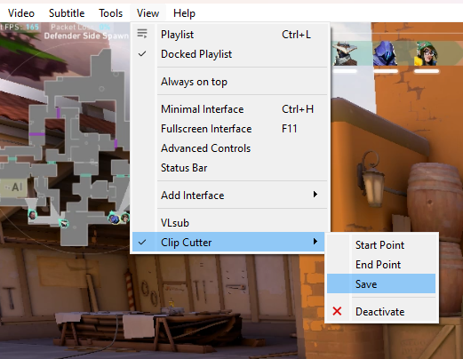

# VLC-Clip-Cutter

Enhance your VLC Player experience with our video cut extension, empowering you to seamlessly trim videos directly within VLC. Set precise start and end points, effortlessly edit, and save your clips—all without compromising quality. Experience uninterrupted video editing, leaving behind the need for recording features

### Installation⚡

1. Download the VLC extension file:
   First, you need to download the VLC extension file (.lua).
2. Locate VLC's extensions directory:
   The location of VLC's extensions directory varies depending on your operating system:

   > Windows: %APPDATA%\vlc\lua\extensions
   >

   > macOS: ~/Library/Application Support/org.videolan.vlc/lua/extensions/
   >

   > Linux: ~/.local/share/vlc/lua/extensions/
   >

   Place the extension file in the directory:
   Once you've located the appropriate directory, copy the extension file into it.
3. Restart VLC:
   After placing the extension file in the directory, restart VLC to ensure that it loads the new extension.
4. Enable the extension in VLC:
   Once VLC is restarted, you need to enable the extension.

### Requirements ⚓

The Clip-Cutter extension trims video files using "FFmpeg"

Install the FFmpeg and set the path to excess it using extension

#### FFmpeg Installation

- Windows (Chocolatey)

  ```
  choco install ffmpeg
  ```

  You can download pre-built versions of FFmpeg for Windows from the official website
- macOS (Homebrew)

  ```
  brew install ffmpeg
  ```
- Linux

  ```
  sudo apt-get install ffmpeg
  ```

### Usage 🍴



- To activate the extension ,click on `View` tab -> `Clip Cutter` . This is activate the extension
- To set start point ,click on `View` tab -> `Clip Cutter` -> `Start Point`
- To set endpoint ,click on `View` tab -> `Clip Cutter` -> `End Point`
- To save the video clip ,click on `View` tab -> `Clip Cutter` -> `Save`
- To deactivate the extension ,click on `View` tab -> `Clip Cutter ` -> `Deactivate`

### Troubleshoot🌠

- Ensure both the start and end points are selected before proceeding.
- Verify that the selected endpoint occurs after the start point and is a valid value.
- Confirm the presence of FFmpeg installation on your system.
- Ensure the FFmpeg path is correctly set by executing 'ffmpeg' in your terminal/command prompt.

### Warning ⚠️

Kindly exercise caution when using this extension. As the developer, I cannot provide a guarantee of its functionality, and it may or may not perform as expected. I cannot be held responsible for any potential damages incurred. This extension is an experimental project, and its use is at your own risk
